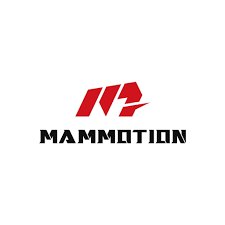

# ioBroker.mammotion

[](https://www.npmjs.com/package/iobroker.mammotion)
[](https://www.npmjs.com/package/iobroker.mammotion)


[](https://nodei.co/npm/iobroker.mammotion/)

## Mammotion adapter for ioBroker

Cloud adapter for Mammotion Luba/Yuka devices.

## Features

- Login via Mammotion cloud (`id.mammotion.com`)
- Device discovery and automatic object creation under `mammotion.0.devices.*`
- Command support (start, pause, resume, stop, dock, cancel, route, non-work-hours, blade control)
- Telemetry via MQTT where available
- Telemetry fallback via Aliyun API polling (`thing/properties/get`, `thing/status/get`)
- **Shared device support** – device can be shared from the main Mammotion account to a dedicated ioBroker account (avoids session conflicts with the mobile app)
- Session retry/reconnect handling when app and adapter logins conflict
- Automatic faster polling after commands and while device is active
- Polling watchdog – automatically restarts polling if it silently stops
- **Zone / area management** – automatic zone discovery, per-zone enable toggles, `startZones` button, `payload` for JS adapter

## Installation

1. Install adapter (local/dev or later via npm/repository).
2. Open adapter instance settings.
3. Enter Mammotion app credentials (see **Account setup** below).
4. Save and start/restart the instance.

## Account setup

### ⚠️ Why you should NOT use your main account

The Mammotion cloud only allows **one active session per account** at a time. This means:

- Every time the adapter re-authenticates (e.g. after a session expiry), your **mobile app gets logged out**.
- Every time you open the Mammotion app on your phone, the **adapter loses its session** and stops polling until it reconnects.

This leads to unreliable automation and constant interruptions in both the app and the adapter.

### ✅ Recommended: Dedicated ioBroker account + device sharing

The clean solution is to create a **second Mammotion account** exclusively for ioBroker and share your device to it. Both accounts then have independent sessions – the adapter and the app never interfere with each other.

**Setup steps:**

1. Register a new Mammotion account (e.g. `yourname+iobroker@gmail.com`).
2. In the Mammotion app (logged in with your **main** account):
   - Open the device → **Settings** → **Share device**
   - Enter the email of the new ioBroker account
3. Log into the Mammotion app with the **new account** and accept the share invitation.
4. Enter the **new account's** email and password in the adapter configuration.

The adapter detects shared devices automatically – no extra configuration needed.

> **Note:** The shared account uses Aliyun API polling instead of MQTT. This is fully functional and has no impact on the available features.

### Option B – Direct login (not recommended)
If you only have one account or do not use the mobile app regularly, you can enter your main credentials directly. Be aware that the adapter and the mobile app will log each other out whenever both are active.

## Configuration

- `email`: Mammotion account email
- `password`: Mammotion account password
- `deviceUuid`: optional app device UUID (default is prefilled)
- `legacyPollIntervalSec`: base polling interval for legacy telemetry (10-300 sec)
- `legacyTelemetryTransport`: currently `poll` is used (`mqtt` option is reserved)

## Objects

### Info

- `info.connection`
- `info.mqttConnected`
- `info.deviceCount`
- `info.lastMessageTs`
- `info.lastError`

### Account

- `account.expiresAt`
- `account.userId`
- `account.userAccount`
- `account.iotDomain`

### Per device

- `devices.<id>.name`, `iotId`, `deviceId`, `deviceType`, `deviceTypeText`, `productKey`, `productKeyGroup`, ...
- `devices.<id>.telemetry.*` (battery, state, gps, firmware version, WiFi RSSI, work time, mileage, task area, last payload/topic/update, areasJson, ...)
- `devices.<id>.commands.*` (actions + writable parameters)
- `devices.<id>.zones.<name>.enabled` – toggle individual zones on/off for batch mowing
- `devices.<id>.zones.<name>.start` – trigger button: immediately starts mowing only this one zone
- `devices.<id>.zones.<name>.hash` – zone hash ID (read-only, filled by device)

## Command behavior

- Action states (`start`, `pause`, `dock`, `applyTaskSettings`, ...) are trigger states (`true` -> execute -> auto reset to `false`).
- `bladeHeightMm` + `targetMowSpeedMs` are auto-applied after value changes (debounced).
- On `commands.start`, task settings are re-applied once after ~25 seconds (or earlier when active state is detected).
- Route settings are auto-applied via `modifyRoute` after value changes (debounced).
- Non-work settings are auto-applied via `applyNonWorkHours` after value changes (debounced).
- `bladeHeightMm` is the canonical cut-height state.
- Additional immediate IoT sync is requested after commands to refresh telemetry faster.

## Zone / area workflow

### Step 1 – Discover zones

Press `commands.requestAreaNames` (button). The adapter queries the device for its full zone list.
The device responds via MQTT — this can take up to **60–90 seconds** on first run because each zone hash is classified individually. Once complete, zone objects appear under `devices.<id>.zones.<zoneName>/`.

Each zone channel contains:

| State | Type | Description |
|---|---|---|
| `enabled` | boolean (writable) | Mark zone for batch mowing |
| `position` | number (writable) | Execution order (1..n) for `startZones` / `startAllZones` |
| `start` | boolean (writable, trigger) | Immediately start mowing this zone only |
| `hash` | string (read-only) | Internal zone hash ID |

---

### Option A – Start a single zone immediately

Set `devices.<id>.zones.<zoneName>.start = true`.
The adapter sends a mowing command for exactly that one zone using the current global settings (`bladeHeightMm`, `targetMowSpeedMs`, etc.).

---

### Option B – Batch: mow multiple zones

1. Set `zones.<zoneName>.enabled = true` for each zone you want to mow.
2. Press `commands.startZones`.

The adapter collects all enabled zones and sends them as a single `modifyRoute` command. Mow settings (knife height, speed, etc.) are taken from the current `commands.*` state values.
Zone execution order is sorted by `zones.<name>.position` (ascending).

---

### Option C – Start all known zones (ignore toggles)

Press `commands.startAllZones`.

The adapter takes all zones from `telemetry.areasJson` and starts a route with all hashes, independent of `zones.*.enabled`.
Order is also sorted by `zones.<name>.position`.

---

### Option D – Full custom payload via JS adapter

Write a JSON object to `commands.payload` to send a completely custom command payload.
Legacy alias `commands.routePayloadJson` still works.

Supported actions:
- route workflow (`action: "startRoute"` or `start: true`)
- route planning only (`action: "generateRoute"|"modifyRoute"|"queryRoute"`)
- task-control buttons via payload (`action: "start"|"pause"|"resume"|"stop"|"dock"|"cancelJob"|"cancelDock"`)
**Minimal example (JS adapter):**

```javascript
// Mow two specific zones with custom settings
setState('mammotion.0.devices.<deviceId>.commands.payload', JSON.stringify({
    action: "startRoute",
    areaHashes: ["12345678901234", "98765432109876"],
    cutHeightMm: 65,
    mowSpeedMs: 0.35
}));

// Stop via payload
setState('mammotion.0.devices.<deviceId>.commands.payload', JSON.stringify({
    action: "stop"
}));
```

**Full example with all available fields:**

```javascript
setState('mammotion.0.devices.<deviceId>.commands.payload', JSON.stringify({
    action: "startRoute",
    // Required: at least one area hash (read from zones.<name>.hash)
    areaHashes: ["12345678901234"],

    // Mowing settings
    cutHeightMm: 65,        // Blade height in mm (model-dependent)
    mowSpeedMs: 0.35,       // Mowing speed in m/s (model-dependent)

    // Route settings
    jobMode: 4,             // Job mode (default: 4)
    channelMode: 0,         // Channel mode: 0=default, 1=spiral, 2=zigzag, 3=custom
    channelWidthCm: 25,     // Lane width in cm (model-dependent)
    towardDeg: 0,           // Mowing direction in degrees (-180–180)
    borderMode: 1,          // Border mode: 0=off, 1=on
    mowingLaps: 1,          // Border laps (0–4)
    obstacleLaps: 1,        // Obstacle laps (0–3)
    isMow: true,            // Mow the area
    isEdge: false,          // Mow edges only
    isDump: true            // Allow grass dump
}));
```

> **Note:** Zone discovery requires MQTT. Shared/legacy-only devices will send the request but the response can only arrive via MQTT — use `requestAreaNames` and wait up to 90 seconds. The `routeAreaIds` state still works as a manual fallback for entering hashes directly.

> **Start button behavior:** `commands.start` is a task-control start (resume/continue on device side). It does not build a new zone selection by itself. Before start, current `bladeHeightMm` + `targetMowSpeedMs` are pushed once. Use `startZones` or `startAllZones` when you want an explicit zone set.

## Notes

- Control/commands are stable (start/pause/stop/dock, zone start/startZones/startAllZones, payload execution).
- Telemetry is currently under active improvement. Some values can stay stale depending on cloud push behavior and MQTT topic coverage.
- `telemetry.lastUpdate` only means a telemetry packet was processed. If values do not change, the cloud may be returning unchanged data.
- Mammotion cloud sessions can invalidate each other (mobile app vs adapter). Using a shared device account (Option B above) avoids this entirely.
- Command limits follow model defaults (example: Luba 20–35 cm route width, Yuka 15–30 cm, Yuka Mini 8–12 cm).
- Device family detection uses productKey as primary source (fallback to deviceType/name), because some API responses report Yuka Mini as generic Yuka.
- ProductKey groups are synchronized from PyMammotion (`pymammotion/utility/device_type.py`) via `npm run sync:product-keys`.
- GitHub workflow `.github/workflows/sync-product-keys.yml` can auto-check weekly and open a PR if new product keys/devices are added upstream.
- Shared devices use Aliyun polling (no MQTT). This is normal and fully functional.

## Changelog

### 0.0.7
- Fixed: zone discovery race condition by adding a per-device discovery lock (prevents parallel classification runs)
- Fixed: unknown hash reclassification handling to reduce temporary zone drops during MQTT flapping
- Fixed: fallback zone naming now creates unique and gap-free Area IDs (no duplicate like `Area_2_2`, no missing `Area_4`)
- Changed: adapter log messages are now consistently in English
- New: standard GitHub QA workflows (`test-and-release`, `dependabot`, `automerge-dependabot`)

### 0.0.6
- New: Product-key sync from PyMammotion (`npm run sync:product-keys`) and optional weekly GitHub workflow PR automation
- New: `devices.<id>.productKeyGroup` state for transparent model classification
- Improved: product-key based model detection to better handle variants like Yuka Mini

### 0.0.5
- Improved: Yuka compatibility for route execution (`startZones`/`startAllZones`/single zone)
- Changed: model-aware limits for command states (including Yuka/Yuka Mini spacing ranges)
- Changed: route reserved-byte mapping aligned with PyMammotion behavior
- Changed: NAV receiver selection adjusted for route commands

### 0.0.4
- New: `commands.payload` + `commands.lastPayload` for JSON-based command execution and traceability
- Changed: `commands.routePayloadJson` kept as legacy alias to `commands.payload`
- Changed: start/route executions now persist the actual payload to `commands.lastPayload`
- Changed: payload can also trigger task-control actions (`start/pause/resume/stop/dock/cancel...`)
- Changed: clean UI profile (advanced/internal states marked as expert)
- Changed: app-like limits enforced for cut height, route width, mowing laps and obstacle laps
- Changed: model-aware command limits (Yuka/Yuka Mini spacing + speed ranges)
- Changed: route reserved bytes and NAV receiver selection aligned to PyMammotion behavior (improves Yuka compatibility)
- Changed: zone execution order via `zones.<name>.position` for `startZones` and `startAllZones`
- Known issue: telemetry coverage is not complete yet (MQTT decoding/RTK fields still in progress)

### 0.0.3
- Fixed: polling silently stops when device cache becomes empty (watchdog added)
- Fixed: shared devices (owned: 0) not detected – legacy bindings now always merged
- Fixed: modern API errors no longer crash the full device refresh
- New: Zone / area management – `requestAreaNames` button, per-zone enable toggles, per-zone `start` button, `startZones` batch button
- New: `routePayloadJson` string state for JS-adapter automations (full route payload as JSON)
- Changed: `routeAreasCsv` renamed to `routeAreaIds` (existing values are migrated automatically)

### 0.0.2
- Improved telemetry refresh strategy (adaptive polling + post-command sync)
- Automatic apply for task, route and non-work settings
- Extended command handling and retry flow

## License

MIT License

Copyright (c) 2026 DNAngel
